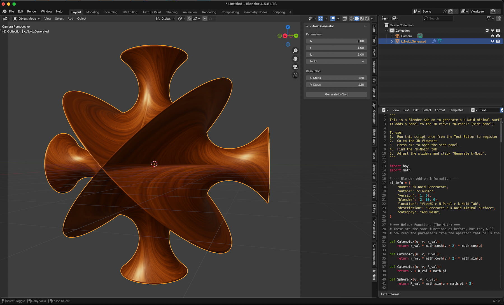
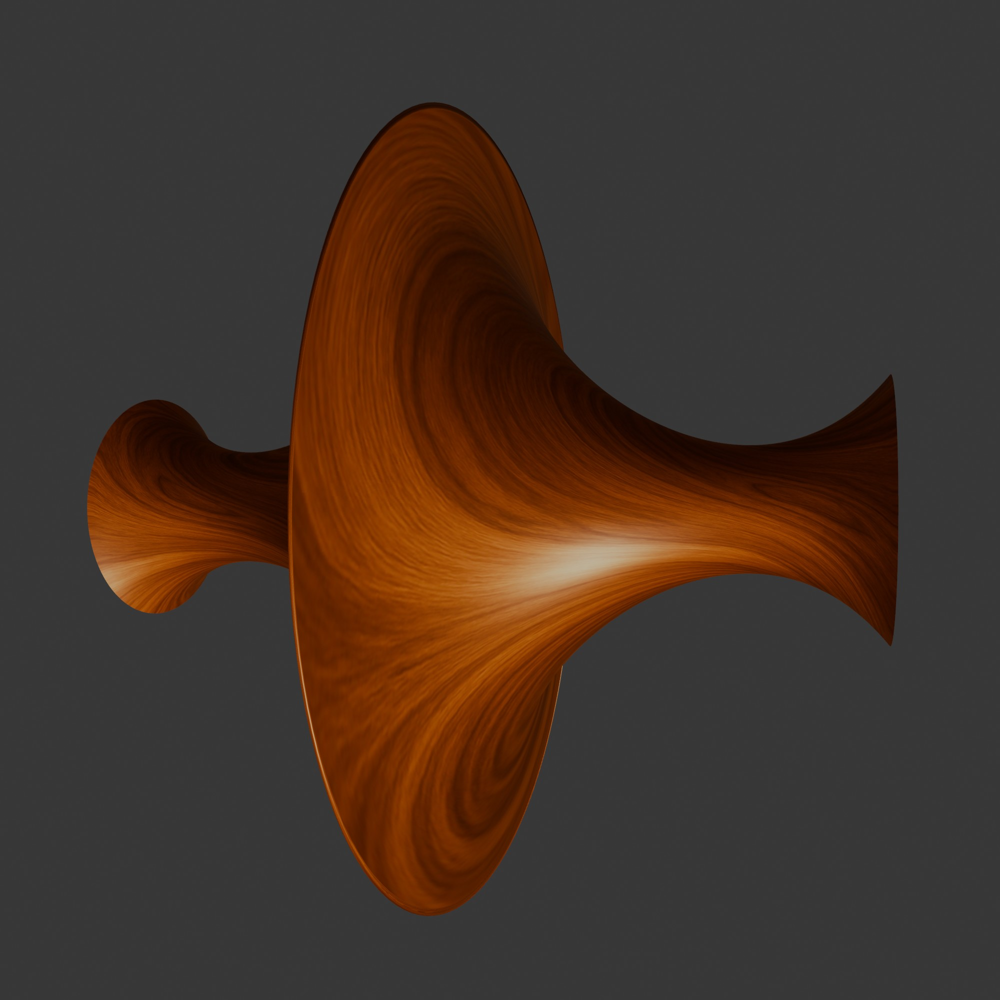
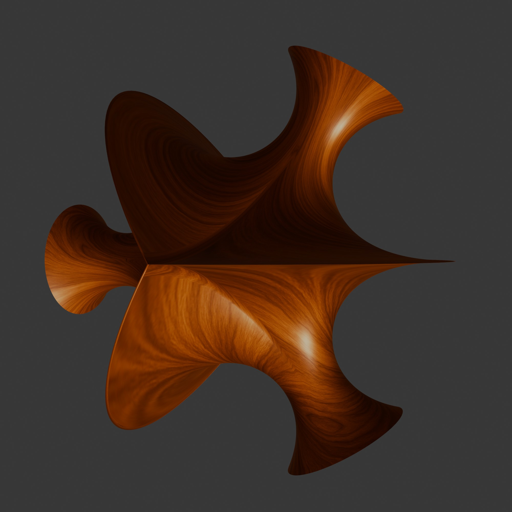
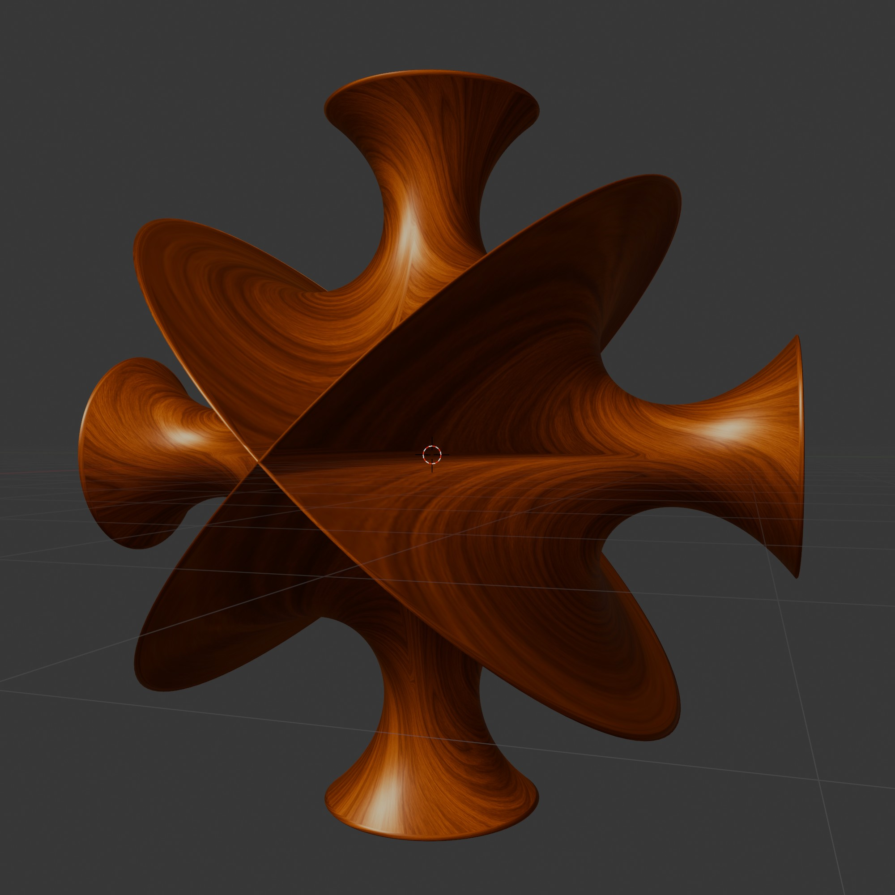
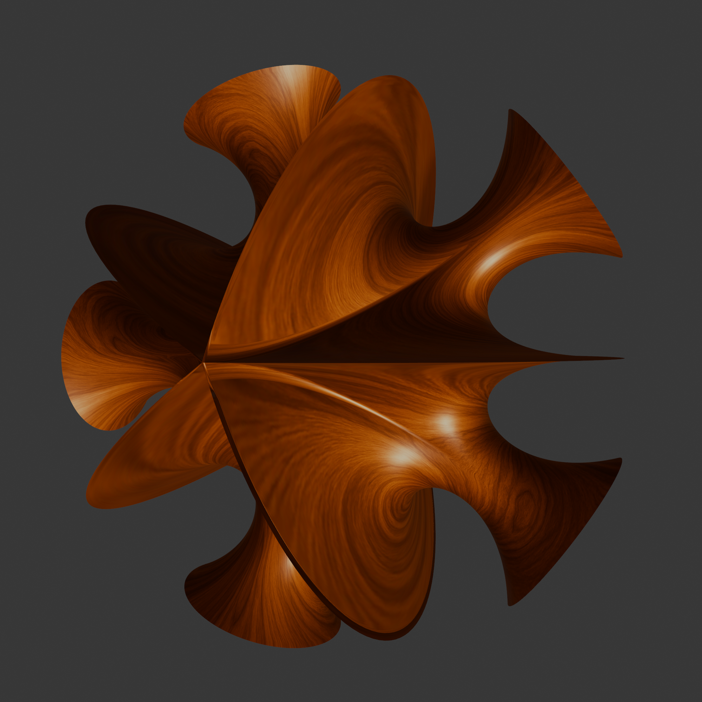
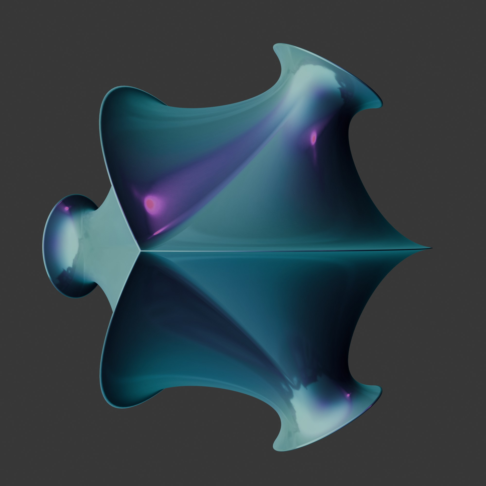
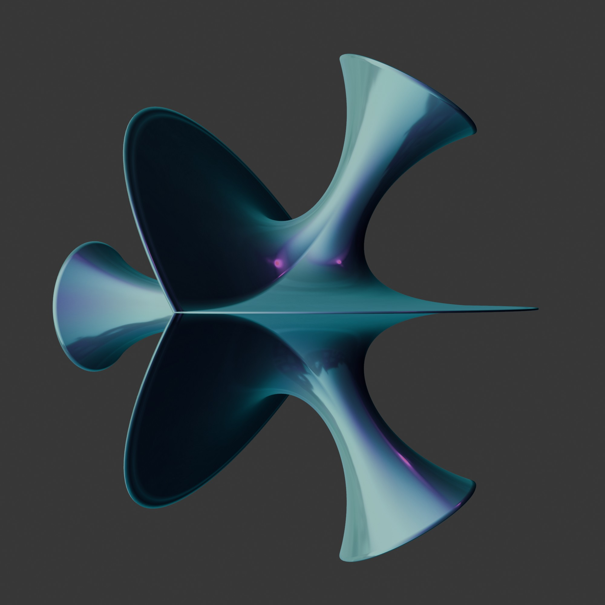
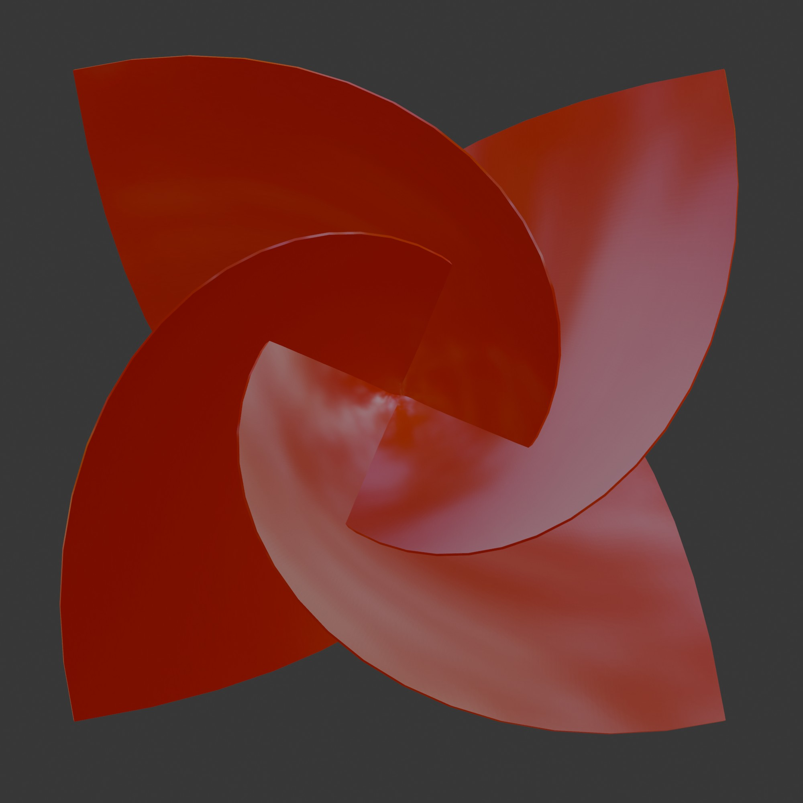
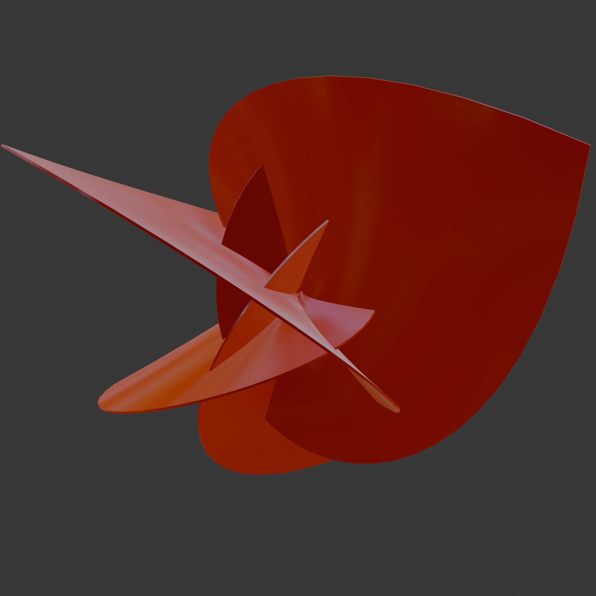

  

# k-Noid Surfaces
This is a Blender Add-on to generate a K-Noid minimal surface. It adds a panel to the 3D View's "N-Panel" (side panel).

# Screen Shot

## The Background
When I tired to develop an add-on  to generate k-noid minimal surfaces, I found that I have not enough skills and understanding to do it by my own. So I asked ChatGpt & co for help. The idea behind this add-on was to create a simple way to create k-noid mathematic minimal surface. You find the main "add-on" script (it is a pre-add-on) that can run as usual in the Blender script editor. But also you find two variations from "deep seek" (see pictures) and a base with mpmath, made by ChatGpt. 

Only the first one is really nice, but the others are interesting as well.

## Views
| Text | Preview |
| :--- | :--- |
| K-Noid with 2 Noid |  |
| K-Noid with 3 Noid |  |
| K-Noid with 4 Noid |  |
| K-Noid with 5 Noid |  |
| K-Noid with a Value of 2.5 |  |
| K-Noid with a Value of 1.5 |  |
| K-Noid with 4 Noid by ChatGpt |  |
| K-Noid with 4 Noid by ChatGpt |  |

## Release Notes

### v1.0.0 (July 31, 2026)
- **Publishing**: First public upload of the Add-on.

## Blender

